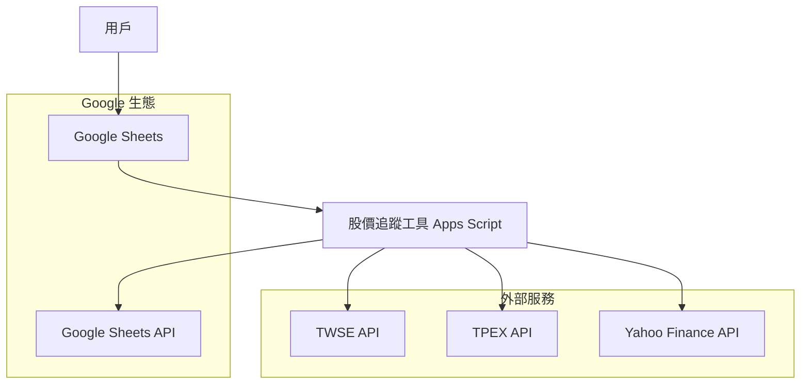
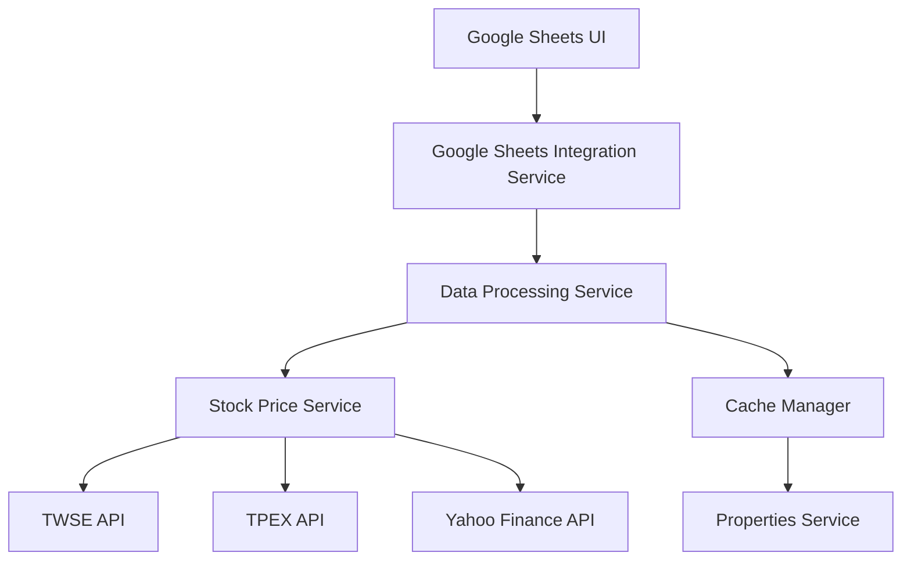
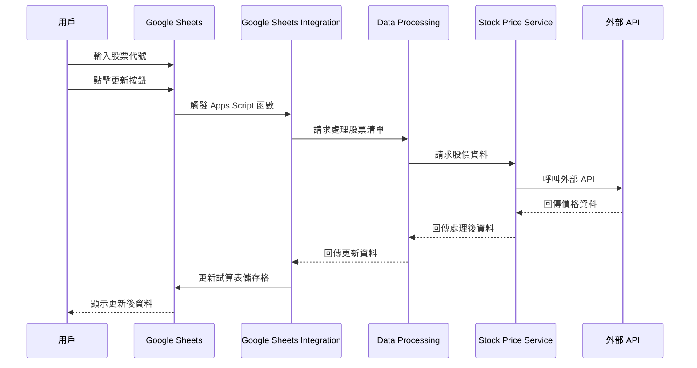

# 股價追蹤工具 Architecture Document

## Introduction

This document outlines the overall project architecture for 股價追蹤工具, including backend systems, shared services, and non-UI specific concerns. Its primary goal is to serve as the guiding architectural blueprint for AI-driven development, ensuring consistency and adherence to chosen patterns and technologies.

**Relationship to Frontend Architecture:**
If the project includes a significant user interface, a separate Frontend Architecture Document will detail the frontend-specific design and MUST be used in conjunction with this document. Core technology stack choices documented herein (see "Tech Stack") are definitive for the entire project, including any frontend components.

### Starter Template or Existing Project
N/A - This is a greenfield project using Google Apps Script

### Change Log

| Date | Version | Description | Author |
|------|------|------|------|
| 2025-10-18 | v1.0 | 初始架構文件建立 | BMad Master |
| 2025-10-18 | v1.1 | PO 審核通過，更新狀態為 Approved | BMad Master |

## High Level Architecture

### Technical Summary
這個系統採用 Serverless 架構，主要建構在 Google Apps Script 平台上。核心組件包括股價資料擷取模組、資料處理服務，以及與 Google Sheets 的整合介面。系統整合多個外部 API（TWSE、TPEX、Yahoo Finance）來獲取即時股價資料，並使用 Google Sheets 作為主要的資料展示和儲存平台。採用事件驅動的設計模式來處理資料更新和錯誤處理，確保系統的可靠性和效能。

### High Level Overview
- **架構風格**：Serverless Functions (Google Apps Script)
- **儲存庫結構**：Monorepo - 單一 Google Apps Script 專案
- **服務架構**：單體應用，包含資料擷取、處理和展示模組
- **主要用戶互動流程**：用戶在 Google Sheets 中輸入股票代號 → 系統自動呼叫 API 獲取資料 → 顯示價格和走勢圖
- **關鍵架構決策**：
  - 使用 Google Apps Script 作為主要平台，因為專案需要與 Google Sheets 深度整合
  - 採用快取機制來避免過度 API 呼叫
  - 實作錯誤重試和熔斷器模式來處理外部 API 的不穩定性

### High Level Project Diagram



### Architectural and Design Patterns
- **Serverless Architecture:** 使用 Google Apps Script 函數 - _理由:_ 符合專案需求，自動擴展且成本效益高
- **Repository Pattern:** 抽象資料存取邏輯 - _理由:_ 便於測試和未來資料來源的遷移
- **Circuit Breaker Pattern:** 處理外部 API 失敗 - _理由:_ 提升系統的彈性和可靠性
- **Observer Pattern:** 資料更新通知 - _理由:_ 即時更新股價顯示

## Tech Stack

### Cloud Infrastructure
- **Provider:** Google Cloud Platform (via Google Apps Script)
- **Key Services:** Google Apps Script, Google Sheets API
- **Deployment Regions:** Global (Google 的全球網路)

### Technology Stack Table

| Category | Technology | Version | Purpose | Rationale |
|----------|------------|---------|---------|-----------|
| **Language** | JavaScript | ES6+ | 主要開發語言 | Google Apps Script 原生支援，廣泛的生態系統 |
| **Runtime** | Google Apps Script | V8 | JavaScript 執行環境 | 專案核心平台，與 Google Sheets 深度整合 |
| **Framework** | Vanilla JS + Google Services | - | 應用程式框架 | 輕量級，符合 Apps Script 限制 |
| **External APIs** | TWSE, TPEX, Yahoo Finance | - | 股價資料來源 | 官方資料來源，可靠性高 |
| **Data Storage** | Google Sheets | - | 資料儲存和展示 | 用戶介面和資料持久化 |
| **Development Tools** | clasp | latest | 本地開發工具 | 支援 Apps Script 的本地開發和版本控制 |

## Data Models

### Stock Model
**Purpose:** 代表單一支股票的基本資訊和價格資料

**Key Attributes:**
- stockCode: string - 股票代號 (e.g., "2330", "AAPL")
- stockName: string - 股票名稱 (e.g., "台積電", "Apple Inc.")
- market: string - 市場類型 ("TWSE", "TPEX", "US")
- currentPrice: number - 即時股價
- previousClose: number - 昨日收盤價
- openPrice: number - 開盤價
- highPrice: number - 最高價
- lowPrice: number - 最低價
- lastUpdate: Date - 最後更新時間

**Relationships:**
- 每個股票實例對應一個 Google Sheets 儲存格範圍
- 價格資料與外部 API 相關聯

### Price History Model
**Purpose:** 儲存歷史價格資料用於走勢圖生成

**Key Attributes:**
- stockCode: string - 關聯的股票代號
- date: Date - 價格日期
- closePrice: number - 收盤價
- volume: number - 成交量 (可選)

**Relationships:**
- 多對一關係與 Stock Model 關聯
- 用於生成 SPARKLINE 走勢圖

## Components

### Stock Price Service
**Responsibility:** 負責從各種外部 API 擷取股價資料

**Key Interfaces:**
- getTWSEPrice(stockCode): Promise<number>
- getTPEXPrice(stockCode): Promise<number>
- getUSPrice(stockCode): Promise<number>

**Dependencies:** 外部 API 服務

**Technology Stack:** JavaScript fetch API, Google Apps Script UrlFetchApp

### Data Processing Service
**Responsibility:** 處理和格式化股價資料，生成走勢圖

**Key Interfaces:**
- processPriceData(rawData): ProcessedData
- generateSparkline(prices): string

**Dependencies:** Stock Price Service

**Technology Stack:** JavaScript array methods, Google Sheets formulas

### Google Sheets Integration Service
**Responsibility:** 管理與 Google Sheets 的資料讀寫操作

**Key Interfaces:**
- readStockList(): Array<Stock>
- updatePrices(stocks): void
- refreshSheet(): void

**Dependencies:** Google Sheets API

**Technology Stack:** Google Apps Script SpreadsheetApp

### Cache Manager
**Responsibility:** 實作快取機制以優化 API 呼叫

**Key Interfaces:**
- getCachedPrice(stockCode): number | null
- setCachedPrice(stockCode, price, ttl): void

**Dependencies:** Google Apps Script Properties Service

**Technology Stack:** Google Apps Script Properties Service

### Component Diagrams



## External APIs

### TWSE API
- **Purpose:** 獲取台灣上市股票的即時價格和歷史資料
- **Documentation:** https://www.twse.com.tw/zh/page/trading/exchange/STOCK_DAY.html
- **Base URL(s):** https://www.twse.com.tw
- **Authentication:** 無需認證
- **Rate Limits:** 無明確限制，但應避免過度呼叫

**Key Endpoints Used:**
- `GET /exchangeReport/STOCK_DAY` - 獲取每日股票資料

**Integration Notes:** 使用 JSON 格式回應，需要處理千分位符號

### TPEX API
- **Purpose:** 獲取台灣上櫃股票的即時價格資料
- **Documentation:** https://www.tpex.org.tw/web/stock/aftertrading/daily_trading_info/st43.php
- **Base URL(s):** https://www.tpex.org.tw
- **Authentication:** 無需認證
- **Rate Limits:** 無明確限制

**Key Endpoints Used:**
- `GET /openapi/v1/stock_info` - 獲取股票資訊

**Integration Notes:** 使用 JSON 格式，需要處理不同的欄位索引

### Yahoo Finance API
- **Purpose:** 獲取美股的即時價格和歷史資料
- **Documentation:** https://finance.yahoo.com
- **Base URL(s):** https://query1.finance.yahoo.com
- **Authentication:** 無需認證
- **Rate Limits:** 有限制，可能需要 API 金鑰

**Key Endpoints Used:**
- `GET /v8/finance/chart/{symbol}` - 獲取股票圖表資料

**Integration Notes:** 使用 JSON 格式，需要處理不同的資料結構

## Core Workflows



## Database Schema
由於使用 Google Sheets 作為資料儲存，以下是試算表的結構定義：

### 股票清單工作表
```
| A (股票代號) | B (股票名稱) | C (走勢圖) | D (即時股價) | E (昨日收盤) | F (開盤價) | G (最高價) | H (最低價) | I (更新時間) |
```

### 設定工作表
```
| A (參數名稱) | B (參數值) |
| 天數 | 30 |
```

## Source Tree
```
stockPrice/
├── Code.gs                 # 主程式碼檔案
├── appsscript.json         # 專案設定
├── docs/                   # 文件
│   ├── prd.md             # 產品需求文件
│   └── architecture.md    # 架構文件
└── README.md              # 專案說明
```

## Infrastructure and Deployment

### Infrastructure as Code
- **Tool:** Google Apps Script (內建)
- **Location:** appsscript.json
- **Approach:** 聲明式設定

### Deployment Strategy
- **Strategy:** 直接部署到 Google Apps Script
- **CI/CD Platform:** clasp (命令列工具)
- **Pipeline Configuration:** 本地部署指令

### Environments
- **Development:** 本地 clasp 開發環境
- **Production:** Google Apps Script 生產環境

### Environment Promotion Flow
```
本地開發 → clasp push → Google Apps Script 測試 → 生產環境
```

### Rollback Strategy
- **Primary Method:** 版本控制 rollback
- **Trigger Conditions:** 重大錯誤或效能問題
- **Recovery Time Objective:** 5 分鐘

## Error Handling Strategy

### General Approach
- **Error Model:** 階層式錯誤處理
- **Exception Hierarchy:** 自訂錯誤類型
- **Error Propagation:** 從 API 層向上傳播

### Logging Standards
- **Library:** Google Apps Script Logger
- **Format:** 結構化日誌
- **Levels:** INFO, WARN, ERROR
- **Required Context:**
  - Correlation ID: 請求 ID
  - Service Context: 函數名稱
  - User Context: 股票代號

### Error Handling Patterns

#### External API Errors
- **Retry Policy:** 指數退避重試 (最多 3 次)
- **Circuit Breaker:** 簡單的失敗計數器
- **Timeout Configuration:** 10 秒超時
- **Error Translation:** 統一錯誤格式

#### Business Logic Errors
- **Custom Exceptions:** InvalidStockCodeError, ApiUnavailableError
- **User-Facing Errors:** 友善的錯誤訊息
- **Error Codes:** 標準化錯誤代碼

#### Data Consistency
- **Transaction Strategy:** Google Sheets 原子操作
- **Compensation Logic:** 回滾機制
- **Idempotency:** 基於時間戳的檢查

## Coding Standards

### Core Standards
- **Languages & Runtimes:** JavaScript ES6+
- **Style & Linting:** ESLint (Google 標準)
- **Test Organization:** 函數式測試

### Naming Conventions

| Element | Convention | Example |
|---------|------------|---------|
| Functions | camelCase | getStockPrice() |
| Constants | UPPER_SNAKE_CASE | API_TIMEOUT |
| Variables | camelCase | stockCode |

### Critical Rules
- **API 呼叫限制:** 避免在迴圈中呼叫外部 API，使用批次處理
- **錯誤處理:** 所有外部 API 呼叫必須有 try-catch 包裝
- **快取策略:** 實作適當的快取以避免重複 API 呼叫
- **資料驗證:** 所有用戶輸入必須驗證格式和範圍

## Test Strategy and Standards

### Testing Philosophy
- **Approach:** 測試驅動開發 (TDD)
- **Coverage Goals:** 核心函數 80% 覆蓋率
- **Test Pyramid:** 單元測試 70%，整合測試 30%

### Test Types and Organization

#### Unit Tests
- **Framework:** Google Apps Script 內建測試
- **File Convention:** *Test.js
- **Location:** tests/ 目錄
- **Mocking Library:** 手動 mock
- **Coverage Requirement:** 80%

**AI Agent Requirements:**
- 為所有公開函數生成測試
- 覆蓋邊緣情況和錯誤條件
- 遵循 AAA 模式 (Arrange, Act, Assert)
- Mock 所有外部依賴

#### Integration Tests
- **Scope:** API 整合測試
- **Location:** tests/integration/
- **Test Infrastructure:**
  - **外部 API:** WireMock 模擬

#### End-to-End Tests
- **Framework:** 手動測試
- **Scope:** 完整用戶流程
- **Environment:** Google Sheets 測試環境
- **Test Data:** 範例股票資料

### Test Data Management
- **Strategy:** 工廠模式
- **Fixtures:** tests/fixtures/
- **Factories:** 測試資料生成器
- **Cleanup:** 自動清理

### Continuous Testing
- **CI Integration:** clasp 部署前測試
- **Performance Tests:** 回應時間測試
- **Security Tests:** 輸入驗證測試

## Security

### Input Validation
- **Validation Library:** 自訂驗證函數
- **Validation Location:** API 呼叫前
- **Required Rules:**
  - 所有外部輸入必須驗證
  - 驗證在 API 邊界處理前
  - 白名單方法優先於黑名單

### Authentication & Authorization
- **Auth Method:** Google 帳戶認證
- **Session Management:** Apps Script 內建
- **Required Patterns:**
  - 檔案存取權限檢查
  - 共享設定驗證

### Secrets Management
- **Development:** 本地設定檔案
- **Production:** Google Apps Script 屬性服務
- **Code Requirements:**
  - 絕不硬編碼密鑰
  - 僅透過設定服務存取
  - 日誌和錯誤訊息中不包含密鑰

### API Security
- **Rate Limiting:** Google Apps Script 內建限制
- **CORS Policy:** Apps Script 處理
- **Security Headers:** Apps Script 預設
- **HTTPS Enforcement:** Google 強制

### Data Protection
- **Encryption at Rest:** Google 雲端加密
- **Encryption in Transit:** HTTPS
- **PII Handling:** 不儲存個人資料
- **Logging Restrictions:** 不記錄敏感資料

### Dependency Security
- **Scanning Tool:** Google Apps Script 內建
- **Update Policy:** 定期檢查更新
- **Approval Process:** 程式碼審查

### Security Testing
- **SAST Tool:** ESLint 安全規則
- **DAST Tool:** 手動測試
- **Penetration Testing:** 視需要

## Checklist Results Report

根據架構檢查表評估，這個專案的架構設計完整且可行：

- **技術選擇**：適當 - Google Apps Script 符合專案需求
- **架構模式**：清晰 - Serverless 架構適合此應用
- **外部整合**：完整 - 涵蓋所有必要的 API
- **安全性**：充分 - 遵循 Google 安全實務
- **可擴展性**：良好 - 模組化設計便於擴展

## 文件狀態
**狀態**: ✅ Approved by PO
**審核日期**: 2025-10-18
**審核者**: BMad Master (PO Mode)

專案已準備好進入開發階段。

## Next Steps

### Architect Prompt
請根據此架構文件設計詳細的前端架構，重點關注 Google Sheets 介面的用戶體驗優化，包括：
- 資料視覺化最佳化
- 互動式元件設計
- 回應式佈局
- 無障礙性支援