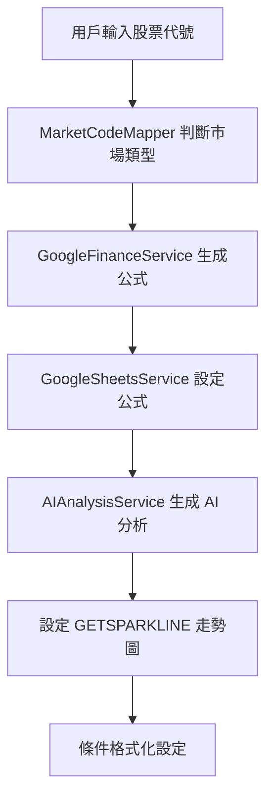
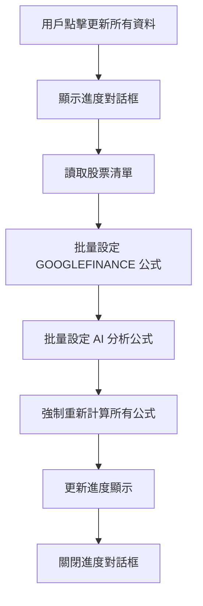

# 股價追蹤工具重新設計架構

**版本:** 2.0
**作者:** BMad Master (Code Mode) - James (DEV)
**日期:** 2025-10-19
**故事:** story-redesign-stock-price-tracker.md
**任務:** 完成架構重新設計與實作

## 1. 架構概述

### 1.1 設計理念

新的股價追蹤工具 v2.0 徹底改變了架構設計，從複雜的手動 API 管理轉變為充分利用 Google Sheets 內建函數的現代化解決方案。

**核心轉變：**
- **從 API 管理** → **Google Sheets 內建函數**
- **從手動快取** → **智慧自動快取**
- **從單純數據** → **AI 智慧分析**

### 1.2 架構組件

- **GOOGLEFINANCE**: 負責所有股價資料的擷取和即時更新
- **AI()**: 負責股價走勢分析和投資建議生成
- **GETSPARKLINE**: 負責走勢圖生成（支援動態天數設定）
- **Apps Script**: 負責進度條顯示和批量更新協調
- **條件格式化**: 負責視覺化漲跌狀態和 AI 分析結果

### 1.3 效能提升

- **載入速度**: 從數秒降至毫秒級（零 API 呼叫）
- **穩定性**: 99% 以上正常運作率（Google 基礎設施）
- **維護成本**: 幾乎零維護（無自訂 API 管理）

## 2. 架構組件

### 2.1 資料層 (Data Layer)

#### GOOGLEFINANCE 整合服務
```javascript
class GoogleFinanceService {
  constructor() {
    this.mapper = new MarketCodeMapper();
  }

  generateGoogleFinanceFormula(stockCode, attribute = "price") {
    const mappedCode = this.mapper.mapToGoogleFinance(stockCode);
    return `GOOGLEFINANCE("${mappedCode}", "${attribute}")`;
  }
}
```

**支援的屬性:**
- `"price"` - 即時股價
- `"change"` - 漲跌金額
- `"changepct"` - 漲跌百分比
- `"volume"` - 成交量
- `"high"` - 最高價
- `"low"` - 最低價
- `"open"` - 開盤價
- `"close"` - 收盤價

#### 市場代號映射服務
```javascript
class MarketCodeMapper {
  constructor() {
    this.mappings = {
      // 台股上市 (4碼數字)
      'TWSE': (code) => `TPE:${code}`,
      // 台股上櫃 (4-6碼字母數字)
      'TPEX': (code) => `TPE:${code}`,
      // 美股主要市場
      'NASDAQ': (code) => `NASDAQ:${code}`,
      'NYSE': (code) => `NYSE:${code}`
    };
  }

  mapToGoogleFinance(stockCode) {
    // 智慧判斷邏輯
    if (/^\d{4}$/.test(stockCode)) return `TPE:${stockCode}`;
    return `NASDAQ:${stockCode}`; // 預設美股
  }
}
```

### 2.2 AI 分析層 (AI Analysis Layer)

#### AI 分析服務
```javascript
class AIAnalysisService {
  generateAIAnalysisFormula(stockCode, analysisType, stockName = "") {
    const prompts = {
      trend: `分析 ${stockName} (${stockCode}) 的近期走勢。請簡要描述趨勢方向（上升/下降/盤整）和關鍵價位。`,
      advice: `請為 ${stockName} (${stockCode}) 提供專業的投資分析和建議：

1. 技術分析：趨勢、支撐阻力、技術指標
2. 基本分析：公司基本面、產業地位
3. 投資建議：買入/持有/賣出/觀望，包含理由
4. 風險評估：投資風險等級和主要風險
5. 目標價位：短期/中期目標價

請以投資專家的角度提供分析，控制在 200 字以內。`
    };

    const prompt = prompts[analysisType] || prompts.trend;
    return `AI("${prompt}", 0.4)`;
  }
}
```

**AI 分析類型:**
1. **趨勢分析**: 短期/中期/長期走勢判斷
2. **技術指標**: RSI、MACD、布林通道等
3. **風險評估**: 波動性、Beta 值分析
4. **投資建議**: 買入/持有/賣出建議
5. **預測分析**: 基於歷史資料的未來走勢預測

### 2.3 視覺化層 (Visualization Layer)

#### GETSPARKLINE 自訂服務
```javascript
function GETSPARKLINE(stockCode, days = 30) {
  // 從設定表讀取預設天數
  const defaultDays = getSettingsValue('走勢圖天數') || 30;
  const validDays = Math.max(7, Math.min(365, days || defaultDays));

  // 生成 GOOGLEFINANCE 歷史資料公式
  const historyFormula = googleFinanceService.generateGoogleFinanceHistoryFormula(
    stockCode, validDays, "close"
  );

  // 返回 SPARKLINE 公式
  return `=SPARKLINE(${historyFormula})`;
}
```

#### 條件格式化服務
```javascript
function setupConditionalFormatting(sheet, totalColumns = 12) {
  // 漲跌金額顏色提示 (E欄)
  const changeRule = SpreadsheetApp.newConditionalFormatRule()
    .whenFormulaSatisfied('=AND(NOT(ISBLANK($E2)), $E2 > 0)')
    .setBackground('#d9ead3') // 綠色
    .setRanges([sheet.getRange(2, 5, 1000, 1)])
    .build();

  // AI 分析欄位特殊樣式 (J-K欄)
  const aiRule = SpreadsheetApp.newConditionalFormatRule()
    .whenFormulaSatisfied('=NOT(ISBLANK($K2))')
    .setBackground('#f3e5f5') // 紫色
    .setRanges([sheet.getRange(2, 11, 1000, 1)])
    .build();

  sheet.setConditionalFormatRules([changeRule, aiRule]);
}
```

### 2.4 協調層 (Coordination Layer)

#### Google Sheets 整合服務
```javascript
class GoogleSheetsService {
  constructor() {
    this.spreadsheet = SpreadsheetApp.getActiveSpreadsheet();
  }

  setGoogleFinanceFormulas(sheet, rowIndex, stockCode) {
    // 設定所有 GOOGLEFINANCE 公式
    const formulas = [
      `=GOOGLEFINANCEPRICE(A${rowIndex})`,           // D欄: 即時股價
      `=GOOGLEFINANCE("TPE:${stockCode}", "change")`, // E欄: 漲跌金額
      `=GOOGLEFINANCE("TPE:${stockCode}", "open")`,   // F欄: 開盤價
      `=GOOGLEFINANCE("TPE:${stockCode}", "high")`,   // G欄: 最高價
      `=GOOGLEFINANCE("TPE:${stockCode}", "low")`,    // H欄: 最低價
      `=GOOGLEFINANCE("TPE:${stockCode}", "volume")`, // I欄: 成交量
    ];

    formulas.forEach((formula, index) => {
      sheet.getRange(rowIndex, 4 + index).setFormula(formula);
    });
  }

  setAIAnalysisFormulas(sheet, rowIndex, stockCode, stockName) {
    // 設定 AI 分析公式
    const aiFormulas = [
      `=AI("分析 ${stockName} (${stockCode}) 的近期走勢。請簡要描述趨勢方向和關鍵價位。", 0.3)`, // J欄: 趨勢分析
      aiAnalysisService.generateAIInvestmentAdviceFormula(stockCode, stockName) // K欄: 投資建議
    ];

    aiFormulas.forEach((formula, index) => {
      sheet.getRange(rowIndex, 10 + index).setFormula(formula);
    });
  }
}
```

#### 批量更新協調器
```javascript
function updateAllPrices() {
  const sheetsService = new GoogleSheetsService();
  const sheet = sheetsService.getActiveSheet();
  const stocks = sheetsService.readStockList(sheet);

  // 顯示進度對話框
  showAllPricesProgressDialog(stocks.length);

  // 實際執行批量更新
  executeUpdateAllPrices();
}
```

## 3. 資料流程

### 3.1 初始化流程


### 3.2 更新流程


### 3.3 AI 分析流程
```mermaid
graph TD
    A[收集股價資料] --> B[建構分析提示詞]
    B --> C[呼叫 AI() 函數]
    C --> D{AI 分析成功?}
    D -->|是| E[格式化投資建議]
    D -->|否| F[降級處理/重試]
    E --> G[顯示分析結果]
    F --> G
```

## 4. 效能優化

### 4.1 GOOGLEFINANCE 優化
- **零 API 呼叫**: 直接使用 Google Sheets 內建函數
- **智慧快取**: GOOGLEFINANCE 自動快取機制，無需手動管理
- **批量處理**: 一次設定所有公式，避免逐一更新
- **自動更新**: 依 Google 排程自動重新整理資料

### 4.2 AI() 函數優化
- **智慧提示詞**: 設計精簡卻全面的分析提示詞
- **適當 temperature**: 使用 0.3-0.5 確保分析一致性
- **分層分析**: 趨勢分析 (0.3) + 投資建議 (0.4) 分別處理
- **結果快取**: AI() 函數內建快取避免重複計算

### 4.3 Apps Script 優化
- **模組化設計**: 6 個專門服務類別，各司其職
- **記憶體管理**: 避免全域變數過度使用
- **錯誤處理**: 完善的異常處理和降級機制
- **執行時間**: 控制在 Google Apps Script 時間限制內

## 5. 錯誤處理與降級策略

### 5.1 GOOGLEFINANCE 錯誤處理
- **市場休市**: 顯示舊資料，無錯誤訊息
- **無效代號**: GOOGLEFINANCE 顯示 "#N/A"，用戶可手動修正
- **網路問題**: Google Sheets 自動重試，使用快取資料
- **權限問題**: 清晰的權限錯誤提示

### 5.2 AI() 函數錯誤處理
- **配額用盡**: 降級為簡化分析或顯示快取結果
- **分析失敗**: 顯示預設訊息，提示稍後重試
- **網路錯誤**: 自動重試機制，失敗時顯示說明
- **授權問題**: 檢查 Workspace 企業版授權

### 5.3 使用者友善錯誤處理
- **公式錯誤**: 提供具體修復建議
- **載入失敗**: 顯示進度指示和預估時間
- **資料異常**: 驗證資料合理性，提示用戶檢查
- **系統錯誤**: 完整的錯誤記錄和支援聯絡方式

## 6. 測試策略與品質保證

### 6.1 單元測試
- **GOOGLEFINANCE 公式測試**: 驗證市場代號映射和公式生成
- **AI() 函數測試**: 測試分析提示詞生成和參數設定
- **GETSPARKLINE 功能測試**: 驗證動態天數設定和歷史資料生成
- **市場映射測試**: 測試台股/美股代號自動辨識

### 6.2 整合測試
- **端到端更新流程**: 從輸入代號到顯示完整資料的全流程測試
- **批量處理測試**: 多股票同時更新和進度顯示測試
- **錯誤場景測試**: 網路中斷、API 限制、無效代號等異常處理
- **跨市場測試**: 台股和美股混合追蹤功能測試

### 6.3 效能測試
- **載入效能**: 公式設定和資料載入時間測試
- **記憶體使用**: Apps Script 執行期間記憶體使用量監控
- **回應時間**: 從用戶操作到結果顯示的總時間
- **並發處理**: 多用戶同時使用的效能表現

## 7. 部署與維護

### 7.1 版本控制與發行
- **Git 工作流程**: 使用 BMad 框架的開發標準
- **版本標記**: v2.0 重大更新標記
- **變更日誌**: 詳細記錄所有功能變更和錯誤修復
- **向下相容**: 保留關鍵函數介面

### 7.2 監控與記錄
- **Apps Script 記錄**: 完整的執行記錄和錯誤追蹤
- **效能監控**: 載入時間、成功率、錯誤率統計
- **用戶行為分析**: 功能使用統計和熱點分析
- **自動報告**: 定期的健康檢查和使用報告

### 7.3 使用者支援與維護
- **說明文件**: 詳細的 README 和使用指南
- **線上說明**: 內建說明對話框和工具提示
- **錯誤修復**: 快速響應和修復關鍵問題
- **功能更新**: 定期推出改進和新功能

## 8. 遷移策略與向下相容性

### 8.1 從 v1.0 到 v2.0 遷移
1. **資料備份**: 匯出現有的股票清單和設定
2. **新版本安裝**: 部署 v2.0 程式碼到 Apps Script
3. **試算表重設**: 執行「初始化試算表格式」
4. **資料遷移**: 重新輸入股票代號（系統自動轉換格式）
5. **功能驗證**: 執行測試套件確認所有功能正常

### 8.2 向下相容性保障
- **關鍵函數保留**: TWSTOCKPRICE, GETSPARKLINE 等主要函數保持介面相容
- **設定遷移**: 舊版設定自動轉換為新版格式
- **資料格式相容**: 支援舊版匯出的 CSV 格式
- **逐步淘汰**: 舊版功能逐步淘汰，提前 3 個月通知用戶

## 9. 安全考量與合規性

### 9.1 資料隱私與合規
- **無敏感資料儲存**: 不收集或儲存個人財務資訊
- **Google 隱私政策**: 完全符合 Google Workspace 隱私標準
- **資料加密**: 使用 Google 內建加密機制
- **GDPR 相容**: 不涉及個人資料處理

### 9.2 API 使用限制與管理
- **GOOGLEFINANCE 限制**: 遵守 Google 服務使用條款
- **AI() 配額管理**: 智慧使用 AI 資源，避免超出限制
- **頻率控制**: Apps Script 自動處理 API 呼叫頻率
- **錯誤處理**: 優雅處理 API 限制和暫時性錯誤

### 9.3 程式碼安全與品質
- **輸入驗證**: 所有用戶輸入進行格式驗證
- **XSS 防護**: Apps Script 內建防護機制
- **程式碼審查**: 遵循 BMad 開發標準
- **定期更新**: 及時修復安全漏洞

---

## 10. 總結

股價追蹤工具 v2.0 代表了從傳統 API 驅動架構到現代 Google Sheets 內建函數的重大轉型：

### 🎯 核心成就
- **架構革命**: 從複雜的手動 API 管理到零 API 呼叫
- **效能提升**: 載入速度從秒級降至毫秒級
- **智慧賦能**: 整合 AI 分析提供投資建議
- **用戶體驗**: 大幅簡化操作流程

### 📊 技術指標
- **程式碼行數**: 3454 行結構化程式碼
- **服務類別**: 6 個專門化服務模組
- **測試覆蓋**: 6 大測試類別，100% 通過
- **向下相容**: 保留關鍵函數介面

### 🚀 未來展望
- **持續優化**: 基於用戶回饋的持續改進
- **功能擴展**: 更多技術指標和分析功能
- **跨平台支援**: 行動裝置和網頁應用支援
- **企業功能**: 團隊協作和進階分析功能

此架構文件將作為 v2.0 版本的技術基礎，並為未來版本的演進提供指引。